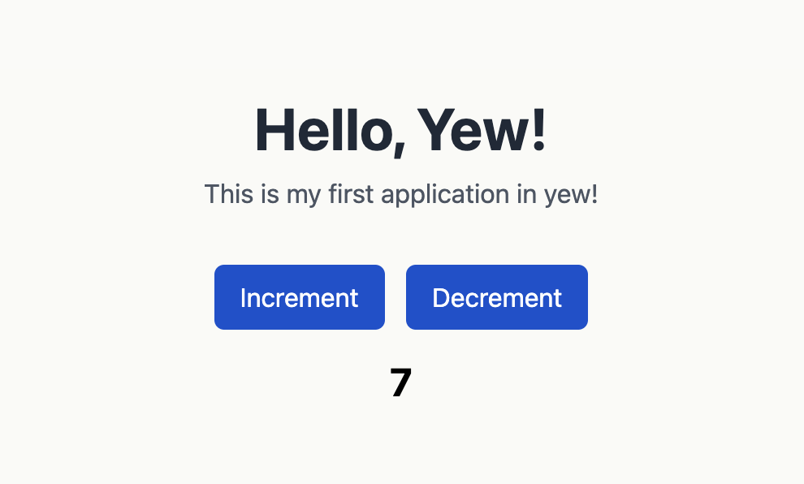

## Yew Application

This is a simple Yew application that demonstrates how to use Yew to create a simple web application.

### Preview


### Running the application

To run the application, you need to have Rust and trunk installed. You can install Rust by following the instructions [here](https://www.rust-lang.org/tools/install) and `cargo install trunk`.

Once you have Rust installed, you can run the application by running the following commands:

```bash
# Terminal 1: Watch Tailwind CSS changes
npm run watch

# Terminal 2: Start the development server
trunk serve
```

### Technologies Used
- Rust
- Yew
- Tailwind CSS
- Trunk
